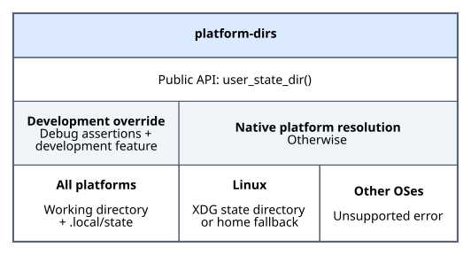

# Architecture

The diagram is generated from [Graphviz source](architecture.dot) and optimized
with SVGO. Run `just diagram` from `crates/platform-dirs` to regenerate it, or
`just --justfile crates/platform-dirs/justfile diagram` from the workspace root.
See [Development tasks](index.md#development-tasks) for prerequisites.

## Responsibility and boundaries

`platform-dirs` resolves the base directory for persistent user state. It does
not append an application name, create directories, or check existence and
permissions. These concerns belong to callers; in this workspace,
`application-runtime` appends the application name and desktop initialization
creates the directory.

Paths remain OS-native `PathBuf` values so non-Unicode names are preserved.
Resolution happens on each call rather than being cached.

## Module structure

- [`src/lib.rs`](../src/lib.rs) exposes `user_state_dir()` and selects the
  development override, a native resolver, or an unsupported-platform error.
- [`src/linux.rs`](../src/linux.rs) owns Linux environment lookup, resolution
  policy, and its unit tests. It is private to the crate.

The public API returns `anyhow::Result<PathBuf>`, keeping platform-specific
implementation details behind a single entry point.

## Compile-time selection

Conditional compilation selects the implementation:

| Configuration | Resolution |
| --- | --- |
| Debug assertions and `development` enabled | Current working directory plus `.local/state`, on any platform |
| Otherwise, on Linux | Native Linux resolver |
| Otherwise, on other platforms | Unsupported-platform error |

The `development` feature is enabled by default. Disabling default features
allows native resolution in debug builds, but Cargo features are additive:
another dependency enabling `development` can re-enable the override.

The Linux module also compiles during Linux tests, allowing its policy to be
checked even when the public entry point uses the development override.

## Linux resolution

The native wrapper reads `XDG_STATE_HOME` with `std::env::var_os` and passes it,
along with `std::env::home_dir`, to an internal resolver.

The resolver accepts an absolute XDG path immediately. Otherwise, it invokes
the home lookup and appends `.local/state` to an absolute home path. Missing,
empty, and relative XDG values trigger the fallback; a missing or non-absolute
home produces an error.

Home lookup is lazy: a valid XDG path does not depend on home resolution.
Neither branch creates or validates the directory on disk.

## Testing strategy

Linux policy tests inject environment values and a home-lookup closure instead
of modifying the process environment. This keeps tests independent and allows
coverage of fallback errors, non-Unicode paths, and whether home lookup runs.

A separate development-mode test checks the public entry point against the
current working directory. Check both default and no-default-features builds
to exercise both public entry-point configurations on Linux. See the workspace
[testing guide](../../../docs/development/testing.md#platform-and-feature-variants).

## Adding a native platform

Add a private platform module and select it in `lib.rs` when the development
override is inactive. Narrow the unsupported-platform branch accordingly and
leave the development override platform-independent.

Keep platform policy behind the existing public API, preserve OS-native paths,
and test platform inputs without mutating global process state. Verify the
native configuration on the target platform and update the support documentation.
